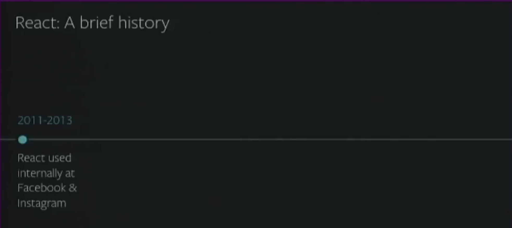
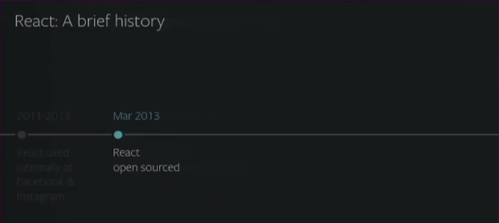
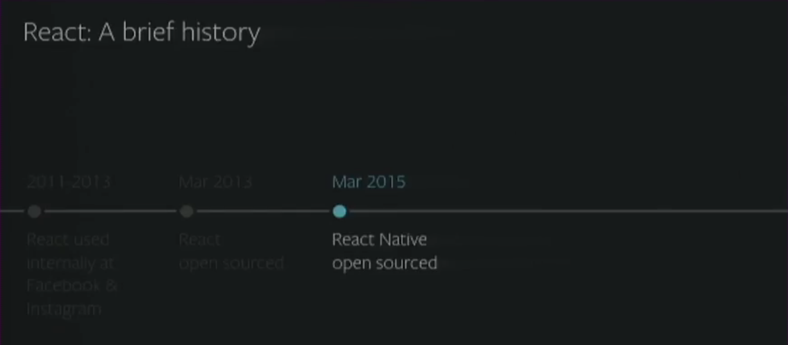
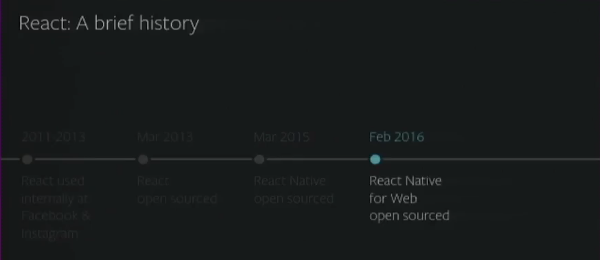
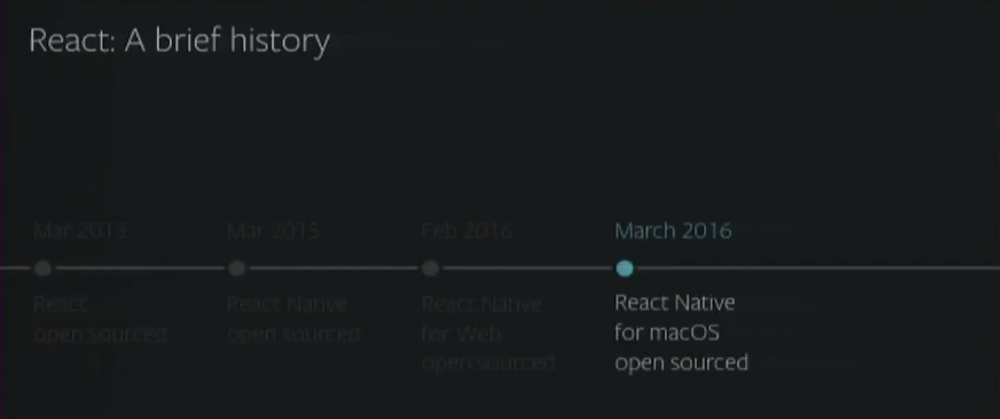
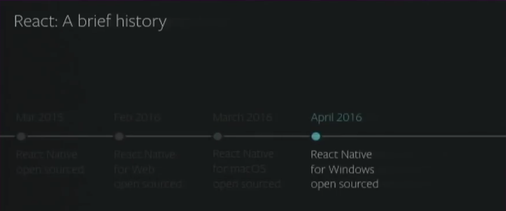
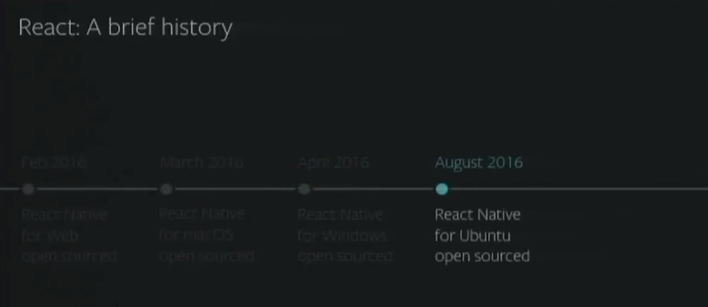
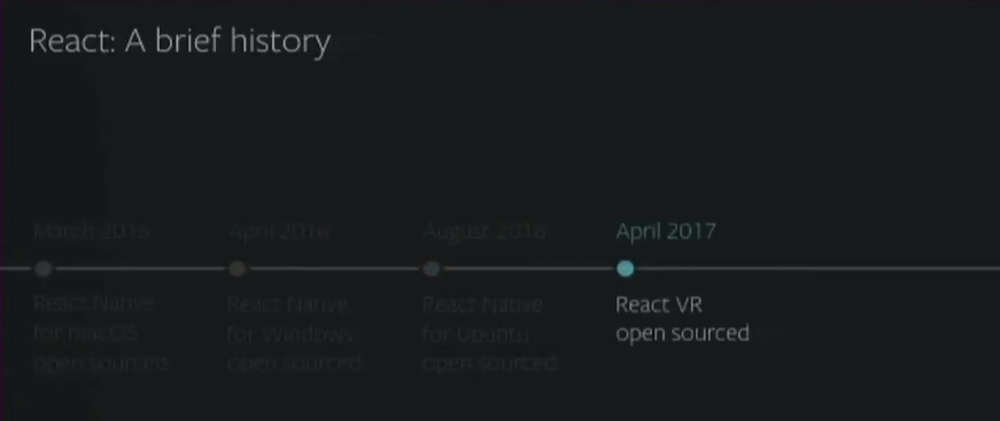

# React Native for Web

## History



> React



> React Native



> React Native for Web



> React Native for macOS



> React Native for Windows



> React Native for Ubuntu



> React VR



## Introduction

- [`GitHub`](https://github.com/necolas/react-native-web#react-native-for-web)

- Who is using React Native in production web apps?

- [`React Native Components and APIs`](https://facebook.github.io/react-native/docs/components-and-apis.html)

- [`Compatibility with React Native`](https://github.com/necolas/react-native-web#compatibility-with-react-native)

- [`Examples`](http://necolas.github.io/react-native-web/examples/)

## Installation

- [`Starter Kits`](https://github.com/necolas/react-native-web/blob/master/packages/website/guides/getting-started.md#starter-kits)

- [`Custom Setup`](https://github.com/necolas/react-native-web/blob/master/packages/website/guides/getting-started.md#configuring-a-module-bundler)

- `webpack.config.js`

```javascript
alias: {
  './assets/images/expo-icon.png': './assets/images/expo-icon@2x.png',
  './assets/images/slack-icon.png': './assets/images/slack-icon@2x.png',
  '@expo/vector-icons': 'expo-web',
  expo: 'expo-web',
  'react-native': 'react-native-web',
},
```

- `React Native Scripts`

```json
"android": "react-native-scripts android",
"ios": "react-native-scripts ios",
"web": "webpack-dev-server -d --config ./webpack.config.js  --inline --hot --colors --content-base public/ --history-api-fallback",
```

## Simple View

- `<View />` = `<div />`

- `<Text />` = `<span />`

- Inspect elements

- [`Multi-platform Applications`](https://github.com/necolas/react-native-web/blob/master/packages/website/guides/getting-started.md#multi-platform-applications)

- File Extension: `*.ios`, `*.android`, `*.web`

## Animated View

- [`Animated API`](http://necolas.github.io/react-native-web/examples/)

## Game - TicTacToe
